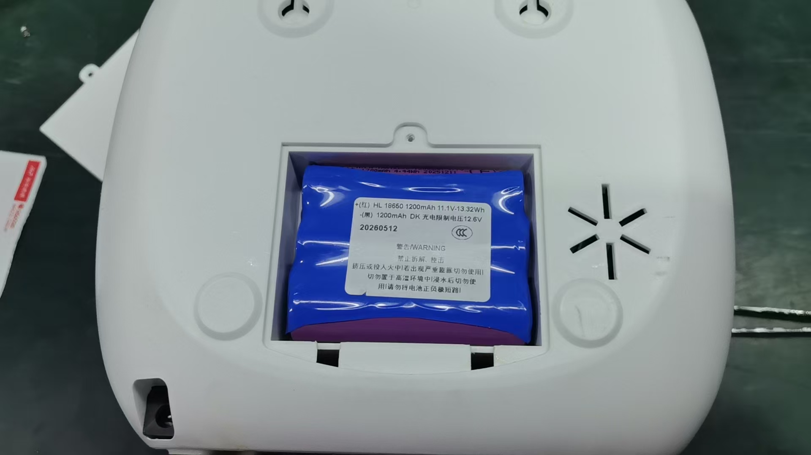
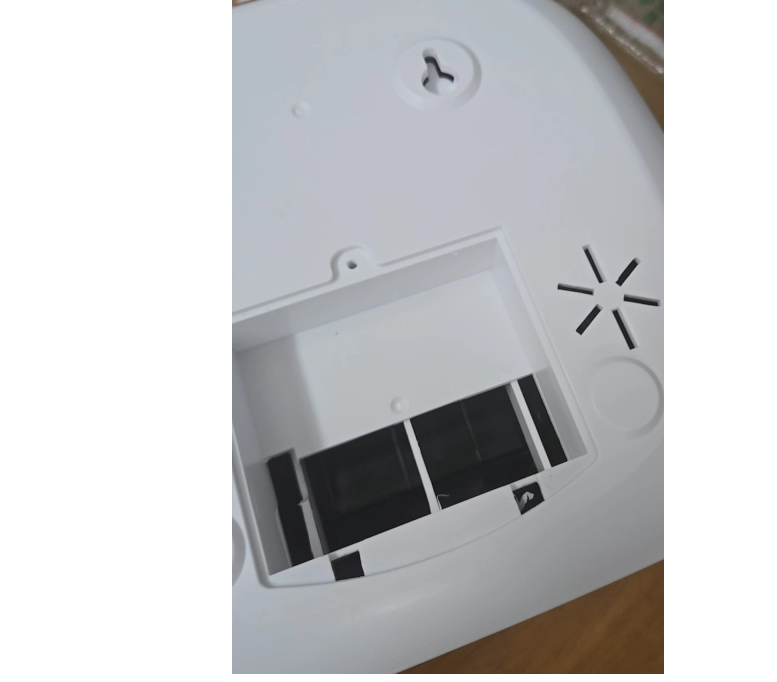
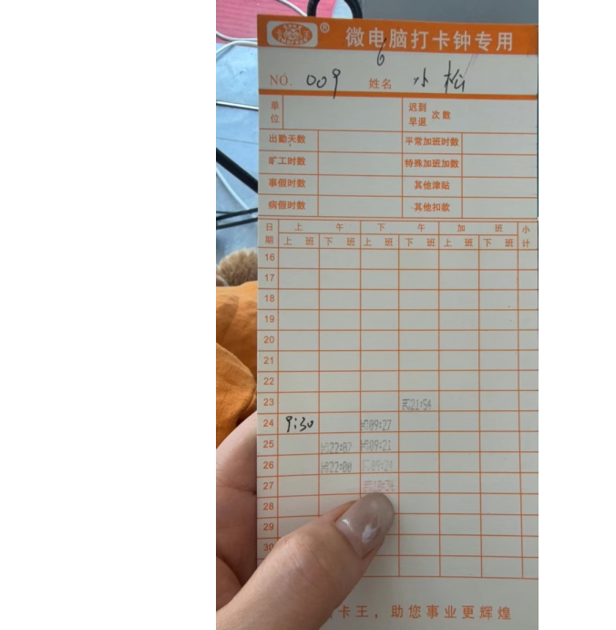
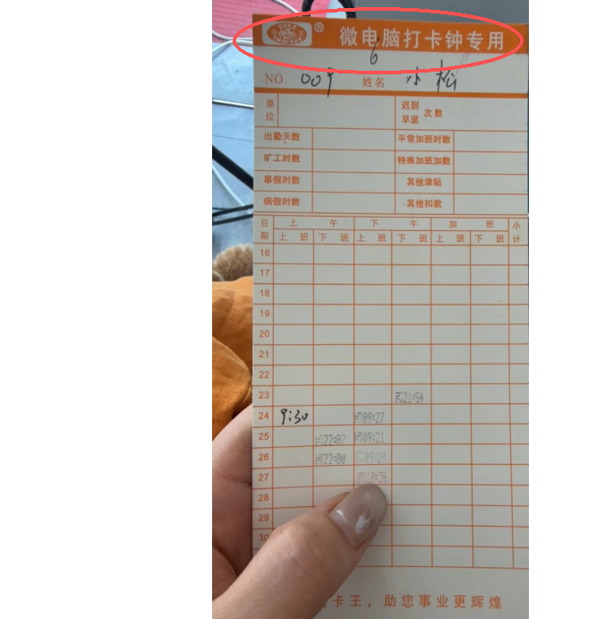
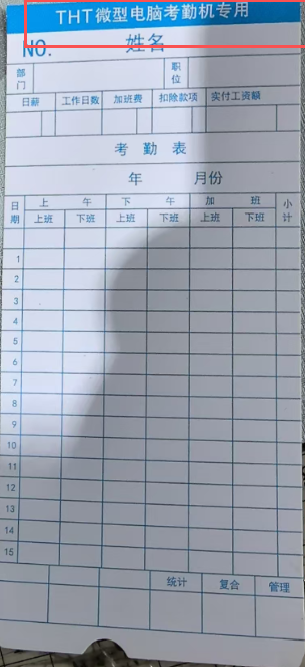
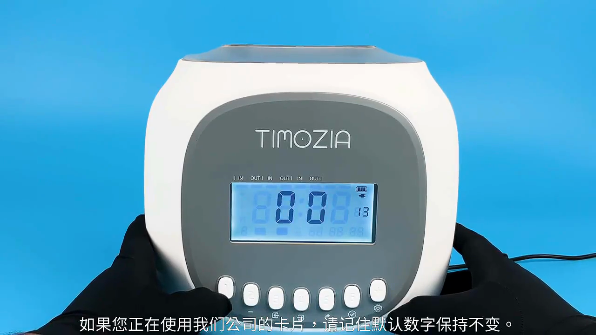
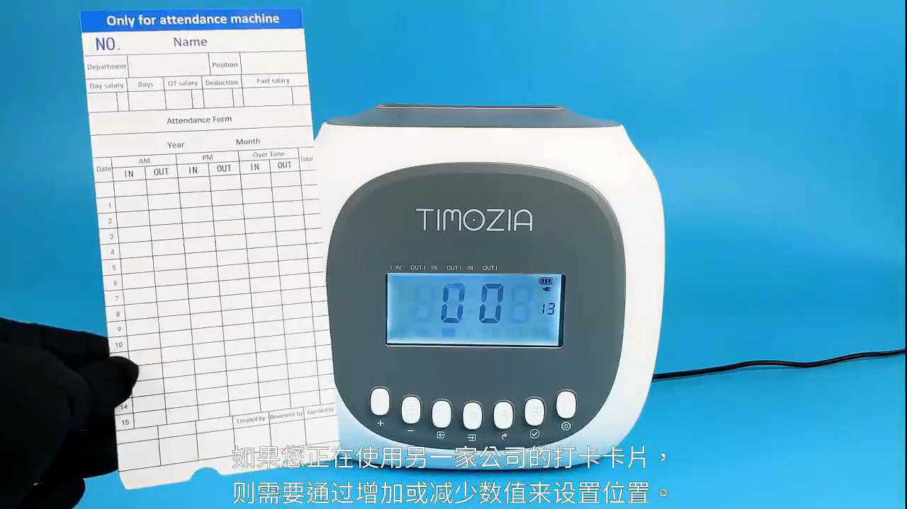

# M880 考勤机售后问题知识库

## 1. 数据概况

```yaml
source_summary:
  rows: 200
  product:
    考勤机-M880: 199
    考勤机: 1
  issue_type_counts:
    调试方法: 119
    理解回复: 60
    打印效果: 21
  source_columns:
    - "日期"
    - "产品类型"
    - "问题分类"
    - "问题点"
    - "正确方法"
```

## 2. 总原则

- M880 问题必须先弄清楚客户的考勤时间，再判断自动打卡还是手动打卡。
- 客户说“打不了卡、位置不对、日期不对、时间不准”时，先看聊天记录和客户已提供信息，不要乱发视频或套模板。
- 自动打卡要按完整上下班时间设置；上下班时间重合、不规律、临时工/钟点工、多组交叉班次，通常优先建议手动打卡。
- 不确定时先问客户“有几组打卡时间，每组上班和下班分别几点，最晚下班到几点”，用 24 小时制确认。
- 打印位置异常不等于补发卡片能解决；先看考勤设置、自检页、色带、原装卡片和 09-15 组设置。
- 涉及退换货、补发配件、赔偿、维修收费、保险只换不修、客户投诉时，自动客服只收集信息并转人工确认。

## 3. 首轮问诊字段

```yaml
m880_first_check:
  model: "M880/M880D/880D-A/蓝牙款/普通款/未知，优先看机器底部标签"
  power_type: "是否停电打卡款，是否打开充电开关，是否使用原装适配器"
  attendance_mode: "自动打卡/手动打卡/不清楚"
  schedule:
    - "一天有几组上班-下班"
    - "每组上班时间"
    - "每组下班时间"
    - "是否跨天到凌晨"
    - "最晚下班时间"
    - "吃饭/休息时间是否固定"
  print_issue: "不打卡/位置不对/日期到前一天/红黑色异常/不清楚/卡纸/不识别卡片"
  supplies: "是否原装考勤卡、是否原装电源、色带是否正确安装"
  evidence_needed:
    - "当前考勤卡打印效果照片"
    - "机器底部标签照片"
    - "设置组号页面照片或视频"
    - "自检页照片"
    - "客户完整班次时间"
```

首轮标准话术：

> 亲，我先帮您把考勤时间理清楚，避免设置错。麻烦您发一下机器型号或底部标签、一天有几组打卡时间，每组上班和下班分别几点，是否有跨天到凌晨，以及现在打印到哪个位置的照片。我按您的时间判断用自动打卡还是手动打卡。

### 3.1 M880/M880D 后盖内部电池视觉识别

用户于 2026-08-10 确认并提供两张去除后盖后的机器照片，用于区分 M880 与 M880D：

- M880D：去除后盖后可见内置电池包。
- M880：去除后盖后未安装电池包。

M880D 带电池证据图：



M880 无电池证据图：



客服判断规则：

1. 客户询问“有没有电池”、“怎么装电池”或“停电能不能打卡”时，先核对机器背面标签或订单型号是 M880 还是 M880D。
2. 已确认 M880D 时，按带内置电池包的版本处理；已确认 M880 时，按无内置电池包的版本处理。
3. 两张图是后盖已去除的内部参考图，不要指导客户自行拆机，不要让客户给 M880 自行加装或改装电池。
4. M880D 证据图中的电池标签只代表该台样机，不将图上容量推广为所有批次的统一规格。

型号未确认时的单一问题：

> 亲，您关注的是机器有没有内置电池。请先看一下机器背面标签，型号是 M880 还是 M880D？

## 4. M880 设置判断规则

### 4.1 自动打卡适用场景

适用信号：

- 上下班时间规律。
- 1-3 组班次比较清楚。
- 上班和下班之间有明确时间差。
- 客户希望员工直接插卡，不想每次按键。

处理规则：

1. 先确认全部班次，使用 24 小时制。
2. 设置组数和每组上班/下班时间。
3. 如果客户问某个时间会打到哪个格子，按上下班中间值判断。
4. 如果有特殊换格时间，可看是否需要设置第 10 组或相关换格参数。
5. 跨天下班时必须关注 09 组换行时间。

模板：

> 亲，您这个可以先按自动打卡判断。请把完整班次按“上班-下班”发我，例如 08:00-12:00、14:00-18:00。自动模式会按每组上下班的中间时间判断打印位置；如果您希望某个时间提前换到下一格，我再帮您看是否需要单独设置换格时间。

### 4.2 必须优先建议手动打卡的场景

典型信号：

- 上班和下班时间重合。
- 多组时间交叉、员工交接班、临时工/钟点工。
- 吃饭时间或下班时间不固定。
- 客户要求“下班后几分钟马上打下一次上班卡”。
- 班次太多，自动模式无法兼顾全部情况。

处理规则：

- 明确告诉客户自动模式无法准确判断时，手动打卡更稳定。
- 手动打卡不限制复杂班次，但每人每天最多打印 6 次卡。
- 第一个人按了对应位置后，后面同位置人员可以直接放卡。

模板：

> 亲，您这个时间有重合/不固定，自动模式容易打到错误位置，建议用手动打卡。手动模式是需要打印哪个位置就按对应按键再放卡，设置好后操作很简单；同一个位置第一个人按好后，后面同位置人员可以直接放卡。每人一天最多打印 6 次。

### 4.2.1 M880 手动打卡（天猫视频与截图）

适用边界：仅适用于型号已确认是M880、平台已确认是天猫，且客户需要手动打卡设置方法的场景。

- 天猫视频：`http://cloud.video.taobao.com/play/u/null/p/1/e/6/t/1/491279010943.mp4`
- 发送片段：`00:03–00:49`
- 核心设置：第02组设置为00；第03–08组按实际班次设置；第09–12组跳过；手动打卡统一打黑色；每人每天最多打印6次。
- 截图1：`assets/qianniu_video_materials/attendance_machine/attendance_manual_punch/nodes/01_manual_hold_settings_ff_6000ms.png`
  - 说明：长按设置键进入手动打卡设置，屏幕进入参数设置状态后再继续。
- 截图2：`assets/qianniu_video_materials/attendance_machine/attendance_manual_punch/nodes/06_manual_confirm_enter_group_03_22000ms.png`
  - 说明：把第02组设置为00并确认后，再进入第03组开始设置实际班次。

固定发送顺序：简短说明 → 天猫视频 → 截图1 → 截图1说明 → 截图2 → 截图2说明。不得同时发送其他平台链接，也不得用英文说明书替代视频。

### 4.3 09 组换行时间

典型信号：

- 下班超过凌晨。
- 客户说打卡日期打印到前一天。
- 客户最晚下班时间很晚，例如到凌晨 1 点、3 点、4 点。
- 客户要设置“换行时间”。

处理规则：

- 先问最晚下班时间。
- 09 组要设置在最晚下班时间之后，通常至少延后约 30 分钟。
- 如果客户下班到凌晨 3 点，09 组不能太早，可按 4 点、5 点等实际需要判断。
- 不确定时转人工确认，不要乱改 09/13 等关键组。

模板：

> 亲，您这个涉及 09 组换行时间。请先告诉我最晚下班到几点，尤其是否超过凌晨。09 组一般要设置在最晚下班时间之后，避免下班卡被打印到前一天或下一行；我确认您的最晚下班时间后再给您对应设置。

### 4.4 15 组卡片识别

典型信号：

- 放很多次纸才识别。
- 偶尔打印位置偏上/偏下。
- 使用的不是原装卡片。
- 有光标但不进纸。
- 打了很多次才成功一次。

处理规则：

1. 先确认是否使用原装考勤卡。
2. 建议将 15 组改为 00 后测试。
3. 重新插电或重启机器再放废卡测试。
4. 蓝牙款/特殊款可在 App 或测试功能里查看是否能自检。
5. 仍不识别，转人工售后。

模板：

> 亲，卡片不识别先确认是不是原装考勤卡。如果不是原装卡，识别会不稳定。您可以先把 15 组改为 00，再断电重启后用废卡测试；如果还是经常不识别，请发机器底部标签和测试视频，我转人工售后继续判断。

## 5. 高频售后问题

### 5.1 不打卡/突然不能打卡

处理顺序：

1. 看屏幕状态，确认是自动还是手动模式。
2. 打印自检页：常见方法为断电后按住 1 号键再插电，放废卡打印自检页。
3. 自检页正常，回到考勤时间和组号设置排查。
4. 自检页不正常，排查电源、卡片、色带、打印头或感应器。
5. 不打卡但位置问题，优先查 02-12 组和 09-15 组。

模板：

> 亲，先判断机器本身能不能打印。您可以用废卡打印自检页测试：断开电源后按住 1 号键，再插上电源并放入废卡。如果自检页正常，我们再重新核对考勤时间和组号设置；如果自检页也不正常，就需要看电源、卡片、色带或机器硬件。

### 5.2 打印位置不对/重叠

典型信号：

- 打到上一格、下一格、最后一格。
- 上班和下班打到同一个位置。
- 日期打印到前一天。
- 第二天/跨天打卡位置异常。

处理顺序：

1. 先看卡纸顶部是否有“THT微型电脑考勤机专用”标记。
2. 没有 THT 标记的卡纸先更换本公司 THT 卡纸复测，不先调整机器参数。
3. 只有 THT 卡纸仍打错位置时，才继续确认机型、完整考勤时间及自动/手动模式。
4. 检查每组上下班时间设置是否正确。
5. 检查 09 组换行时间，跨天班次尤其重要。
6. 检查 10-12 组是否被误设置，必要时恢复空值或按说明设置。
7. 本公司 THT 卡纸、型号和班次均确认后仍错位，再按对应机型的打印位置方法小幅调整。

模板：

> 亲，我先确认卡纸是否匹配，避免误调机器。请看一下卡纸顶部是否印有THT标记？

#### 5.2.1 打印日期数字与卡纸日期行不匹配

已确认的视觉证据示例：打印内容显示 24 日，但落在卡纸 23 日的行位。这表示实际日期与打印的物理位置不匹配，不属于月底日期跳转问题。根据用户后续提供的卡纸标识证据，本案例根因是非 THT 卡纸版式与机器不匹配，不是机器打印位置参数先发生故障。



非本公司卡纸证据：顶部只写“微电脑打卡钟专用”，没有 THT 标记。



本公司卡纸识别标记：顶部印有“THT微型电脑考勤机专用”。



判断时必须分开看两件事：

1. **打印内容**：机器打出的日期数字是否与当天实际日期一致。
2. **物理行位**：印记是否落在卡纸上同一日期的横行内。

分流规则：

- 数字正确、行位错误：先看卡纸顶部是否有 THT 标记，不先调日期或机器参数。
- 无 THT 标记：先更换顶部印有“THT微型电脑考勤机专用”的本公司考勤卡复测。
- 有 THT 标记仍错位：再核对型号和平台，发送唯一对应的打印位置方案。
- 数字本身错误：归入日期/时间设置或断电记忆排查。
- 数字和行位都跨到前一天/后一天：再结合实际班次判断 09 组换日/跨天设置。

自然月份换日规则：

- 有31天的月份：30日的下一天是31日，31日的下一天是次月1日。
- 只有30天的月份：30日的下一天是次月1日。
- 2月按当年是否闰年从28日或29日进入次月1日。
- 无论哪种月份，打印的日期数字与卡纸行位都应对应同一日期。

客服处理边界：

- 本案例证据已能确认是非 THT 卡纸版式不匹配，应先说明卡纸问题并更换本公司 THT 卡纸复测。
- 未用 THT 卡纸复测前，不调整机器打印位置，避免换回正确卡纸后反而打偏。
- 操作步骤因机型不同而不同：标准 M880/M880D 与 M880UT 蓝牙款不可混用。
- 只有换用 THT 卡纸后仍错位，才进入型号确认和机器调整分支。

首轮回复：

> 亲，照片里这张卡顶部没有 THT 标记，不是我们公司的考勤卡。卡纸版式和定位不同，会造成打卡位置偏移。您是想更换顶部带THT标记的本公司考勤卡，还是继续使用这张第三方卡微调位置？

#### 5.2.2 第三方卡纸继续使用时的位置微调视频

- 优先建议换用顶部带 THT 标记的本公司考勤卡。
- 客户明确继续使用第三方卡纸时，可以自行小幅微调打印位置。
- 此分支只适用于已确认的 M880/M880D 标准按键款；不向 M880UT 蓝牙款发送该操作。
- 发送前核对客户当前平台，只发送天猫、京东或拼多多中唯一对应的链接。
- 第三方卡纸需小幅调整，保存后用废卡试打；不保证所有第三方卡都能完全匹配。

第三方卡纸位置微调视频：

- 内容：`打卡位置微调`
- 片段：`第三方卡纸调整`
- 有效操作时段：`00:26–00:38`
- 天猫：<http://cloud.video.taobao.com/play/u/null/p/1/e/6/t/1/491279178909.mp4>
- 京东：<https://vod.300hu.com/24/4c1f7a6atransbjngwcloud1oss/7123d37d905842367050850305/1097_537_1_087158fbf_f.mp4>
- 拼多多：<https://video5.pddpic.com/i1/2025-02-28/ed2a79ddf042649eaf77336bf18a16e1.mp4>

截图说明（客户已确认继续使用第三方卡后，最多发这两张）：





视频局限：

- 视频在第 13 组演示第三方卡按实际偏移微调。
- 视频没有展示插卡后的最终打印结果，也没有稳定展示保存动作。客服必须补充“小幅调整、按确认键保存、再用废卡试打”，不能说视频已验证打印成功。

客户选择继续使用第三方卡后，如果平台信息尚未确认，每轮只问一个问题：

> 亲，可以继续用这张第三方卡微调位置。请问您当前是天猫、京东还是拼多多平台？我给您发对应的原视频和截图。

### 5.3 时间不准/星期日期异常

典型信号：

- 时间久了差十几秒。
- 关机后时间变化。
- 星期不对、日期前面少一位、时间前有数字。
- 客户以为日期显示异常就是机器坏。

处理规则：

- 传统纸卡考勤机没有联网更新时间功能，轻微时间误差可手动校准。
- 关电通常不应导致第二天考勤时间完全丢失；如果每次断电都乱，需查机型、电池/记忆电池、电源和售后。
- 停电打卡款要打开充电开关并充满电。
- 时间前的数字可能是日期，日期显示少一位不一定影响打印，先看打印效果。
- 星期不对通常先检查年份/日期设置。

模板：

> 亲，传统纸卡考勤机没有联网自动校时功能，使用久了有十几秒误差可以手动校准。您先发一下机器显示的年月日和时间、机器型号，以及打印出来的日期位置；如果每次断电后时间都会乱，我会转人工售后帮您检查记忆电池/电源状态。

### 5.4 不开机/断电打卡

处理规则：

- 先确认是否使用原装适配器。
- 可用同规格电源短暂测试，但要确认电压/规格一致。
- M880D/880D-A 这类停电打卡款需要打开机器上的充电开关并充满电，断电待机时间通常有限。
- 普通款不支持停电打卡，客户需要停电使用时可推荐 D 款。
- 新机不开机、适配器摔坏或缺失，补发/退换必须转人工确认。
- 电源 100-240V 通常可用，但具体插头/使用环境仍需客户确认。

模板：

> 亲，先确认一下是否使用原装适配器。如果是停电打卡款，机器上充电开关要打开并先充满电；普通款是不支持断电打卡的。如果原装电源也不开机，请发机器底部标签和电源照片，我转人工售后核实补发电源、退换或寄修方案。

#### 5.4.1 所有考勤机通用原装电源标准

用户确认：所有考勤机统一使用同款原装电源。客服核对原装电源时使用以下标准，不再按考勤机型号区分电源规格。

铭牌参数：

- 电源类型：开关电源适配器。
- 型号：`WT23-250130-BF`。
- 输入：100–240V，50/60Hz，0.5A Max。
- 输出：12.0V DC 2A。
- 制造商：THT-Space Electrical Company Ltd。
- 外观：白色两扁脚电源适配器，连接白色DC圆形接头。

图片证据：

- 原始铭牌图：`sources/user_uploads/attendance_machine/official_power_adapter/original_label_view.jpg`。
- 原始外观和接头图：`sources/user_uploads/attendance_machine/official_power_adapter/original_side_view.jpg`。
- 客服发送用美化铭牌图：`sources/user_uploads/attendance_machine/official_power_adapter/beautified_label_view.png`。
- 客服发送用美化外观和接头图：`sources/user_uploads/attendance_machine/official_power_adapter/beautified_side_view.png`。

核对规则：

- 优先核对铭牌型号、输入和输出，不能只凭插头或接头能够插入就判断是原装电源。
- 客户电源铭牌与上述标准不一致时，不指导继续带电测试；先停止使用并转人工确认适配性。
- 电源破损、异常发热、异味、冒烟、松动或线缆裸露时，立即停止使用并断电，转人工售后。
- 客户只是询问原装电源外观时，可以按顺序发送美化铭牌图和美化外观接头图。

客户回复：

> 亲，所有考勤机使用的是同款原装电源，铭牌型号为WT23-250130-BF，输入100–240V、50/60Hz、0.5A Max，输出12V 2A。我把原装电源的铭牌和接头图片发您核对；不能只看插头是否能插入，需要以铭牌参数一致为准哈。

### 5.5 色带、打印不清、红黑色异常

典型信号：

- 印记不清、印记缺失、没有墨。
- 一半黑一半红、突然变红、红色消耗快。
- 打印重叠、上下偏移、整体偏左。

处理顺序：

1. 先重新安装色带，确认色带没有皱、扭曲、橡皮筋/胶片未去除。
2. 色带要放在正确金属片同侧。
3. 确认是否原装电源和原装考勤卡。
4. 迟到早退红色、正常上下班黑色；可全黑，但不能全红。
5. 重新安装色带后仍明显缺失，可能打印头问题，转人工售后。

模板：

> 亲，印记不清或红黑异常先重新安装色带。请确认色带没有皱、扭曲，固定橡皮筋/胶片已处理好，并装在正确位置。迟到早退通常会显示红色，正常上下班是黑色；如果自检或正常打卡仍固定缺失，就需要人工售后判断打印头。

### 5.6 卡纸、卡片规格、放置安装

规则：

- 建议使用原装考勤卡。
- 常见考勤卡规格：约 85mm x 185mm，厚度约 0.4mm-0.8mm。
- 卡纸先检查卡槽异物、卡片宽度、是否原装卡。
- 墙面安装可用随附膨胀螺丝，背面孔距约 9cm；也可直接放台面。
- 卡架通常需要另购，是否赠送看订单 SKU。

模板：

> 亲，卡纸或识别不稳先用原装考勤卡测试，常见卡片规格约 85mm x 185mm、厚度 0.4mm-0.8mm。请检查卡槽是否有异物，卡片是否太宽或太厚；如果原装卡仍卡纸，请发卡槽视频和机器标签，我转售后继续判断。

#### 5.6.1 20栏位考勤卡架尺寸

产品信息：

- 卡架容量：20栏位，左右两列排列。
- 卡架整体尺寸：约 41.5 × 21 × 3.2 厘米（高 × 宽 × 厚）。
- 单栏入卡宽度约 8.6 厘米。
- 单栏入卡深度约 14.5 厘米。
- 图片证据：`sources/user_uploads/attendance_machine/attendance_card_rack_20_slot.jpg`。
- 卡架通常需要另购，是否随机器赠送应以客户订单SKU或商品套餐为准，不直接承诺赠送。

客户回复：

> 亲，这款是20栏位的考勤卡架，整体尺寸约为高41.5厘米、宽21厘米、厚3.2厘米；单栏入卡宽度约8.6厘米，入卡深度约14.5厘米。是否包含卡架需要看您购买的订单套餐哈。

### 5.7 打印头不移动并伴有“咔咔”声：步进马达失步

适用型号：M880、M880D、T960、T960S。四款机器使用同一判断和排查逻辑，但发送操作材料前仍须核对客户实际型号与当前平台。

典型信号：

- 插入考勤卡后，打印头没有移动或明显卡住。
- 机器伴有连续“咔咔”作响声。
- 正常的吸纸、打印头移动、打印和出纸流程没有完成。

统一名称：这种“打印头被卡住、步进马达仍尝试动作并发出咔咔声”的现象称为“步进马达失步”。客服统一使用“打印头”，不使用其他名称。

核心判断：只要客户视频或语音中清楚出现已确认的连续“咔咔”特征声或啸叫声，就直接判定为步进马达失步。这两种声音本身都是充分诊断证据，不需要再询问异响发生时机、打印头是否移动、是否插卡或其他故障确认点。

客服确认原则：客户通常不了解机器内部结构，不要求客户判断打印头、马达或内部机构。听到该特征声后直接告知“这是步进马达失步”，随后仅按售后材料发送要求核对机器型号和当前平台；型号、平台核对不是重新确认故障。

三项原因按固定优先级排查：

1. **优先确认是否使用原装电源。** 客户没有使用随机配套的原装电源时，可能造成步进马达驱动力不足。需要核对电源整体和铭牌，不以插头能够插入作为判断标准。
2. **确认色带安装和色带本身是否正常。** 色带盒没有装正、色带破损/缠绕、长期使用老化，或色带驱动转轴不能顺畅转动，都会卡住打印头。
3. **最后检查打印头移动轨道。** 如果画面中没有看到整张卡纸卡在机器内，必须提示客户先断电，再查看轨道上是否夹有卡纸碎屑或其他异物。卡纸弯曲、翘边、受潮或起皱也可能造成轨道卡阻。

处理顺序：

1. 先确认客户是否使用随机配套的原装电源，并收集电源整体及铭牌照片核对。不能只凭插头能够插入就判断可用。
   - 核对标准统一使用“5.4.1 所有考勤机通用原装电源标准”，并可发送美化铭牌图与美化外观接头图。
2. 再检查色带是否装正、是否破损/缠绕或老化；必要时取下色带测试。取下色带后恢复正常时，检查色带驱动转轴能否顺畅转动；转轴不顺或色带异常时更换色带。
3. 最后检查打印头移动轨道。机器上盖打开或内部零件外露时必须先断电，不要通电伸手或强行推动打印头。画面中没有看到整张卡纸卡在机器内时，查看轨道上是否有卡纸碎屑或异物；不方便安全取出时停止操作。
4. 原装电源、色带安装及色带本身、打印头移动轨道三项检查均正常，但机器仍出现失步声音时，停止继续排查，转人工按当前订单平台办理退回维修。

对应视频与截图：

- 使用素材卡 `attendance_replace_ribbon`（更换考勤机色带）。
- 天猫：`http://cloud.video.taobao.com/play/u/null/p/1/e/6/t/1/491106253912.mp4`
- 京东：`https://jvod.300hu.com/vod/product/1621802063/21852/6f64a1d65b3a4004862da086df5d1296.mp4`
- 拼多多：`https://video5.pddpic.com/i1/2025-02-28/adb6cdaabd9a2f5464e803d0f4707b11.mp4`
- 截图1：`assets/qianniu_video_materials/attendance_machine/attendance_replace_ribbon/nodes/06_identify_printhead_gap_47500ms.png`。本段从视频 `00:46` 开始（对应操作范围 `00:46–00:55`），确认色带必须穿过打印头与上方不锈钢片之间的间隙。
- 截图2：`assets/qianniu_video_materials/attendance_machine/attendance_replace_ribbon/nodes/09_tighten_ribbon_63000ms.png`。本段从视频 `01:01` 开始（对应操作范围 `01:01–01:04`），转动侧面小轮收回松弛色带，并确认小轮能够顺畅转动。
- 发送顺序固定为：简短故障说明 → 当前平台视频 → 截图1 → 截图1说明 → 截图2 → 截图2说明。未确认平台时不发送视频链接。
- 只要知识库已有对应指导视频和截图，诊断后必须随解决方案发送，不得只回复文字步骤；严格使用客户当前平台的一个视频链接，并逐张附上截图说明。

模板：

> 亲，您视频里这种连续“咔咔”声或啸叫声就是考勤机步进马达失步。请先确认使用的是机器原装电源，再检查色带是否安装正确、色带有没有破损或卡住；最后断电检查打印头移动轨道上是否有卡纸碎屑或异物。三项都正常仍然异响，就需要按订单平台申请退回维修。

### 5.8 考勤机正常打卡机械流程与日期行定位基准

适用型号：M880、M880D、T960、T960S。该视频是内部诊断对照基准，不作为未确认故障分支时的客户操作教程。

标准正确流程：卡纸被吸入 → 打印头移动定位 → 完成打印 → 卡纸送出。

正确结果必须同时满足：

- 卡纸能够连续吸入并在打印后正常送出。
- 打印头发生可见移动并完成打印。
- 打印内容中的日期数字与卡纸的物理日期行一致。
- 本标准视频打印“10 17:58”，并落在卡纸第10日行。

正式视频证据：

- 视频 SHA-256：`0fd371f20d1ce373d97a9da5c734f1fbcef3882b02ae25fba959cbd344450136`。
- 时长：约 `6.896` 秒；画面尺寸：`720×1280`；编码：H.264。
- 证据目录：`outputs/customer_video_analysis/0fd371f20d1c_3a3f5681fb54ad961c9442665d3b242e/`。
- 联系表：`outputs/customer_video_analysis/0fd371f20d1c_3a3f5681fb54ad961c9442665d3b242e/contact_sheets/contact_sheet_001.jpg`、`contact_sheet_002.jpg`。
- 关键截图：`00:00` 初始进卡、`00:01.50` 卡纸被吸入、`00:03.00` 打印头移动定位、`00:06.896` 出纸并显示第10日正确落印结果。

与步进马达失步的对比：正常视频中打印头会移动并完成出纸；出现已确认的连续“咔咔”特征声或啸叫声时，直接判定为步进马达失步，不再追加其他故障确认问题。声音可以确定故障类型，但具体诱因仍按色带、卡纸、原装电源的顺序排查。

## 6. 退换、配件、版本与承诺

### 6.1 必须转人工场景

```yaml
must_route_to_human:
  refund_exchange:
    - "客户要求退货、换货、退款、重新拍"
    - "订单过退换期，客户购买第三方只换不修服务"
    - "客户用投诉威胁退货"
  parts_compensation:
    - "漏发电源线、少卡片、缺配件、数据线/适配器补发"
    - "充电器摔坏、按键卡住、机器外观/宣传不符"
    - "色带消耗过快或要求补发耗材"
  hardware_repair:
    - "不开机、屏幕不亮、打印头疑似损坏、纸张打坏"
    - "普通款断电后时间每次都乱"
    - "自检页异常、原装卡和15组设置后仍不识别"
  model_version:
    - "收到型号不符、发错货、新老版本随机、停电打卡款换购"
    - "客户要求语音或视频调试"
```

### 6.2 自动客服可先解释的边界

- 普通款不支持停电打卡；需要断电待机可看 M880D/880D-A。
- 手动打卡适合不规律、重合、多组交叉班次。
- 机器以屏幕显示时间为准；补卡通常需要先把机器时间调到要补卡的时间再打。
- 机器没有联网自动校时，轻微时间误差可手动校准。
- 新老版本外观/链接展示可能不同，功能以实际型号和店铺规则为准；涉及不符/退换转人工。
- 电子说明书可通过机身二维码或店铺资料发送。

## 7. 高价值训练卡

| 编号 | 场景 | 客户信号 | GPT 处理规则 |
|---|---|---|---|
| m880-001 | 09 组换行 | 跨天、日期到前一天、最晚下班很晚 | 先问最晚下班时间，09 组设在最晚下班之后 |
| m880-002 | 自动/手动选择 | 时间重合、临时工、交叉班 | 建议手动打卡，不要硬套自动班次 |
| m880-003 | 位置不对 | 打到上一格/下一格/最后一格 | 先收集完整班次，再查 02-12 和 09-15 组 |
| m880-004 | 不打卡 | 机器不打印、插卡没反应 | 先打自检页，再分设置/硬件 |
| m880-005 | 卡片不识别 | 放很多次才识别 | 原装卡 + 15 组改 00 + 重启测试 |
| m880-006 | 时间不准 | 差十几秒、关机后乱 | 轻微漂移可校准；断电乱转人工查电源/电池 |
| m880-007 | 停电打卡 | 客户要断电使用 | 普通款不支持，D 款需开充电开关并充满电 |
| m880-008 | 色带异常 | 红黑不对、印记不清 | 重新安装色带，确认色带位置和原装电源 |
| m880-009 | 卡纸 | 卡片进不去/纸张打坏 | 原装卡、规格、卡槽异物、自检；仍异常转人工 |
| m880-010 | 漏发/缺配件 | 少卡片、电源线、说明书 | 可先登记缺件，补发必须转人工确认 |
| m880-011 | 客户看不懂视频 | 密码确认不了、不会设置 | 直接指出关键步骤，如初始密码 0000，不要只发视频 |
| m880-012 | 新老版本/宣传不符 | 收到机器与图片不同 | 解释新老版本/功能边界，退换或不符争议转人工 |
| m880-013 | 非THT卡纸导致日期行位不匹配 | 打印24日但落在23日行，卡顶部无THT标记 | 根因为第三方卡纸版式不合；先换本公司THT卡复测，不先调机器 |

## 8. 禁用话术

- 客户问具体班次时，只发视频教程或欢迎语。
- 未确认完整上下班时间，就直接给组号设置。
- 客户时间明显重合，还硬让客户自动打卡。
- 打印位置不对就直接补发卡片。
- 机器不开机不查原装电源/是否 D 款开关，就直接寄回。
- 补发、赔偿、换货、退货、维修费用直接承诺。
- 客户要求语音/视频调试时完全忽略。
- 不看聊天记录，反复让客户重新说明已经提供过的信息。

## 9. 可直接复用模板

班次收集：

> 亲，我先按您的考勤时间帮您判断。请按这个格式发我：第一组上班-下班、第二组上班-下班、第三组上班-下班，全部用 24 小时制；另外告诉我最晚下班是否会到凌晨。这样我才能判断用自动打卡还是手动打卡。

时间重合/不规律：

> 亲，您这个上下班时间有重合/不固定，自动打卡容易打错位置。建议用手动打卡：需要打印哪个位置就按对应按键再放卡，设置好后员工按规则操作会更稳定。

打印位置不对：

> 亲，打印位置不对先看完整设置。请发当前考勤卡打印照片、所有上班下班时间，以及 02-09 组的设置照片。我先判断是班次设置、换行时间，还是卡片/色带问题。

跨天/09 组：

> 亲，您这个涉及跨天下班，需要看 09 组换行时间。请告诉我最晚下班几点，09 组一般要设置在最晚下班之后，避免打到前一天或下一行。我确认时间后再给您对应设置。

不打卡自检：

> 亲，先测试机器本身能不能打印。您可以拔掉电源，按住 1 号键同时插上电源，再放一张废卡打印自检页。自检页正常就继续检查考勤设置；自检页不正常我会转人工售后判断电源、色带或机器硬件。

色带/印记不清：

> 亲，先重新安装色带，确认色带没有皱、扭曲，固定橡皮筋/胶片已处理好，并且使用原装电源和原装考勤卡。重新安装后仍固定缺失或不清楚，就需要人工售后判断打印头。

时间轻微误差：

> 亲，传统纸卡考勤机没有联网自动校时功能，时间久了有十几秒误差属于需要手动校准的情况。您先按教程校准时间；如果每次断电后时间都会乱，我再转人工售后帮您查电源或记忆电池。

缺件/补发：

> 亲，我先帮您核对缺件。麻烦拍一下收到的全部配件和机器底部标签。确认确实少发后，我会转人工售后登记补发；补发信息以平台订单和人工核实为准。
