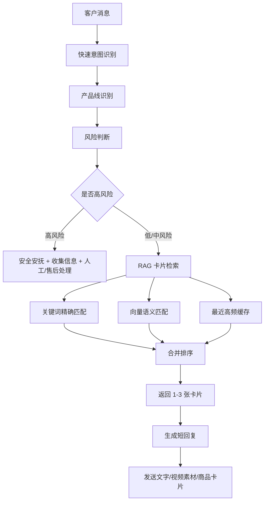

# 客服 RAG 优化方案

## 1. 当前问题

现有知识库优点是资料完整，缺点是不适合客服实时回复：

- 文件是长 Markdown，RAG 容易召回大段背景，生成回复慢。
- 同一个问题散落在多个文件里，例如“色带”同时存在于 M880、针打、竞品、视频素材。
- 低风险教程和高风险售后规则混在一起，容易出现“该转人工却自动承诺”的风险。
- 视频素材目前只有后台位置，没有公开直链，RAG 必须明确“发送素材卡片，不编造链接”。
- 客服场景需要 3-10 秒内先回应，不能每次完整检索所有资料。

优化方向不是压缩文件，而是把知识拆成可检索、可执行、可风控的规则卡片。

## 2. 目标架构



核心原则：

- 先判断风险，再查知识。
- 先用关键词命中高频问题，再用向量兜底。
- 每次只返回 1-3 张卡片，不把整篇知识库塞给模型。
- 低风险自动处理，高风险不承诺结果。

## 3. RAG 卡片格式

建议建立主数据文件：

`customer_service_rag_cards.jsonl`

每行一条规则卡片。

```json
{
  "id": "attendance_date_video",
  "version": "2026-05-16",
  "status": "active",
  "source_files": ["qianniu_video_materials_kb.md", "attendance_machine_m880_after_sales_issues_kb.md"],
  "product_line": "考勤机",
  "models": ["M880", "Attendance Machine", "纸卡考勤机"],
  "intent": "video_tutorial",
  "issue": "设置日期",
  "keywords": ["日期", "调日期", "设置日期", "年月日", "时间日期", "考勤日期", "date"],
  "synonyms": ["日期不对", "年份不对", "月份不对", "机器日期错了"],
  "risk_level": "low",
  "auto_reply_allowed": true,
  "required_slots": ["确认是考勤机/M880同类"],
  "reply_template": "亲，设置日期有对应视频，我发您这个教程。您先按视频调年月日；如果机器页面不一样，拍一下当前屏幕我接着帮您看。",
  "actions": [
    {
      "type": "send_qianniu_video_card",
      "location": "千牛 > 商品 > 素材中心 > 我的图片/视频 > 视频 > Attendance Machine > 11.set date",
      "public_url": null,
      "note": "后台素材，无客户可直接打开的公网链接，不得编造链接。"
    }
  ],
  "do_not_say": ["直接看视频就行", "链接随便发一个"],
  "escalation": "如果客户说视频看不懂或机器页面不同，要求拍当前屏幕；多轮仍不行转人工售后。"
}
```

### 字段说明

| 字段 | 用途 |
|---|---|
| `id` | 唯一编号，便于日志统计和复盘 |
| `product_line` | 先按产品线缩小检索范围 |
| `models` | 绑定型号，避免不同机器步骤混用 |
| `intent` | 售前、教程、故障、售后、投诉、物流、发票等 |
| `keywords/synonyms` | 关键词检索和同义词扩展 |
| `risk_level` | `low/medium/high`，决定是否可自动回复 |
| `auto_reply_allowed` | 是否允许直接发给客户 |
| `required_slots` | 生成回复前必须确认的信息 |
| `reply_template` | 可直接生成的短话术 |
| `actions` | 发送视频、商品链接、要求图片、转人工等动作 |
| `do_not_say` | 禁用话术，防止旧话术污染 |
| `escalation` | 升级条件 |

## 4. 风险分层

### 4.1 Low：可自动回复

适合自动处理：

- 售前基础咨询。
- 标准教程：日期设置、色带安装、自检、驱动安装、端口修改。
- 低风险排查第一步：让客户发型号、样张、自检页、截图。
- 发送千牛素材中心视频卡片。

自动回复特点：

- 短。
- 亲切口语化。
- 有下一步。
- 不承诺售后结果。

### 4.2 Medium：先收集信息

适合先问清楚：

- 打印不清、白纸、没反应、端口异常。
- 班次设置、跨天、迟到颜色、M880 响铃。
- WiFi/蓝牙连接不稳定。
- 客户发了图片/视频但不能完全判断。

处理方式：

- 先复述问题。
- 收集型号、系统、连接方式、样张/自检页。
- 给 1-3 个排查步骤。
- 多轮未解决转人工。

### 4.3 High：不自动承诺

必须谨慎或转人工：

- 退款、退货、换货、补发、赔偿。
- 差价、优惠券、运费、专属优惠。
- 维修收费、打印头过保、寄修地址、检测结论。
- 发票开具/重开/抬头税号。
- 差评、投诉、平台介入、小二介入、12315。
- 客户已多轮发图/视频证明质量问题。

自动客服只能：

- 安抚。
- 收集必要信息。
- 说明需按订单和平台规则核实。
- 不承诺金额、结果、时效。

## 5. 检索策略

### 5.1 先路由

在 RAG 前先做轻量分类：

```yaml
route:
  product_line:
    - attendance_machine
    - thermal_printer
    - dot_matrix_printer
    - wifi_bluetooth
    - order_after_sales
    - tmall_rule
  intent:
    - presale
    - tutorial
    - troubleshooting
    - after_sales
    - complaint
    - invoice
    - logistics
    - video_material
```

例子：

- “日期怎么调” -> `attendance_machine + tutorial + video_material`
- “点了打印没反应” -> `printer + troubleshooting`
- “打印头过保多少钱” -> `after_sales + repair_fee + high_risk`
- “退货怎么处理” -> `after_sales + refund_return + high_risk`

### 5.2 混合检索

客服 RAG 不建议只用向量检索，应该混合：

1. **关键词精确匹配**
   - `色带`、`日期`、`端口`、`白纸`、`自检`、`班次`。
2. **同义词扩展**
   - `打印空白 = 白纸 = 没字`
   - `没反应 = 不打印 = 任务没动`
   - `日期不对 = 年月日错 = 考勤日期错`
3. **向量检索兜底**
   - 客户表达不标准时使用。
4. **规则置顶**
   - 高风险规则必须优先于普通话术。
5. **缓存**
   - 最近高频问题直接命中，不再查长库。

### 5.3 排序公式

建议排序权重：

```yaml
score:
  exact_keyword_match: 40
  product_line_match: 25
  intent_match: 20
  model_match: 20
  risk_rule_match: 30
  vector_similarity: 0-30
  recent_success_cache: 20
  missing_required_slot_penalty: -20
  high_risk_boost: 50
```

高风险场景即使语义相似度不高，也要优先命中安全规则。

## 6. 卡片库拆分

建议从现有 Markdown 迁移成这些库：

```text
rag_cards/
  00_global_safety.jsonl
  01_video_materials.jsonl
  02_attendance_machine_m880.jsonl
  03_thermal_printer.jsonl
  04_dot_matrix_printer.jsonl
  05_wifi_bluetooth_printer.jsonl
  06_order_after_sales.jsonl
  07_presale_product_links.jsonl
  08_competitor_and_evaluation.jsonl
```

### 6.1 全局安全库

来源：

- `tmall_customer_service_rules.md`
- `qianniu_customer_service_training_kb.md`

内容：

- 禁止辱骂、争吵、威胁。
- 不站外交易。
- 不冒充平台。
- 退款/差价/发票/维修费必须核实。
- 3 分钟响应、旺旺满意度等服务指标。

用途：

- 放在所有检索前，作为安全过滤层。

### 6.2 视频素材库

来源：

- `qianniu_video_materials_kb.md`

优先迁移：

- `11.set date`
- `5.ribbon replace m...`
- `12.self test .mp4`
- `2.set shift .mp4`
- `Thermal printer win10`
- `Thermal win11`
- `Needle Printer`
- `WiFi BT Needle Printer`

关键规则：

- 有公开视频链接才发链接。
- 只有后台素材时，动作是 `send_qianniu_video_card`。
- 不能对客户说后台链接。

### 6.3 M880/考勤机库

来源：

- `attendance_machine_m880_after_sales_issues_kb.md`
- `m880_attendance_machine_kb.md`
- `printernoble_m880_official_specs_kb.md`

高频卡片：

- 日期/时间设置。
- 班次设置。
- 09 组换行。
- 15 组卡片识别。
- 自检页。
- 色带/红黑双色。
- 响铃/音乐提醒。
- 停电打卡款。

### 6.4 热敏机库

来源：

- `thermal_printer_after_sales_issues_kb.md`

高频卡片：

- 打印白纸。
- 点打印没反应。
- 端口修改。
- 纸张规格不一致。
- 打印不清/黑条/白线。
- Win10/Win11 驱动教程。
- 平台/手机打印边界。

### 6.5 针打库

来源：

- `dot_matrix_after_sales_issues_kb.md`
- `printernoble_td630_dot_matrix_kb.md`
- `printernoble_bluetooth_wifi_dot_matrix_kb.md`

高频卡片：

- 色带安装。
- 不打印/脱机/暂停。
- 前后进纸。
- 感应器清理。
- 纸厚杆。
- 打印偏移。
- 多联纸/发票/送货单。
- WiFi IP 端口。

## 7. 初始迁移优先级

第一阶段只迁移 80-120 张卡片，不要一次追求全量。

### P0：必须先做

| 类型 | 数量 | 目的 |
|---|---:|---|
| 高风险安全规则 | 20 | 防止乱承诺 |
| 高频视频素材 | 15 | 提速发送视频 |
| 热敏高频故障 | 15 | 覆盖当前咨询 |
| M880 高频设置 | 15 | 覆盖考勤机 |
| 针打高频故障 | 15 | 覆盖 TD630/TH880 |
| 售前产品链接/适配 | 10 | 帮助成交 |

### P1：第二阶段

- WiFi/蓝牙复杂设置。
- 发票/物流/优惠券流程。
- 竞品对比。
- 差评和投诉复盘。
- 产品评价亮点/常见差评原因。

### P2：长期补充

- 每天未命中问题。
- 新视频素材。
- 新产品 SKU。
- 新平台规则。
- 新客服错误案例。

## 8. 示例卡片

### 8.1 色带安装视频

```json
{
  "id": "attendance_ribbon_video",
  "product_line": "考勤机",
  "models": ["M880", "Attendance Machine"],
  "intent": "video_tutorial",
  "issue": "色带安装/更换",
  "keywords": ["色带", "换色带", "安装色带", "打印淡", "ribbon"],
  "risk_level": "low",
  "auto_reply_allowed": true,
  "reply_template": "亲，色带安装视频发您了。您先按视频把色带盒卡进去，再轻轻转一下色带旋钮，让色带绷直；装好后如果打印还是淡，拍一下安装位置我帮您看哈。",
  "actions": [
    {
      "type": "send_qianniu_video_card",
      "location": "千牛 > 商品 > 素材中心 > 我的图片/视频 > 视频 > Attendance Machine > 5.ribbon replace m..."
    }
  ],
  "do_not_say": ["视频里都有自己看", "随便装一下就行"]
}
```

### 8.2 端口修改

```json
{
  "id": "windows_printer_change_usb_port",
  "product_line": "打印机",
  "models": ["热敏机", "针式打印机", "TD630", "TP518"],
  "intent": "troubleshooting",
  "issue": "点打印没反应/端口修改",
  "keywords": ["端口", "USB001", "USB002", "没反应", "点了打印没反应", "打印任务不动"],
  "risk_level": "medium",
  "auto_reply_allowed": true,
  "required_slots": ["Windows电脑", "USB连接"],
  "reply_template": "亲，在电脑“控制面板-设备和打印机”里，右键这台打印机，点“打印机属性-端口”，勾选 USB 开头的端口，一般是 USB001/USB002。每换一次点“应用”，再打印测试页试下。",
  "actions": [
    {
      "type": "ask_screenshot_if_failed",
      "fields": ["设备和打印机页面", "端口页面"]
    }
  ],
  "escalation": "换端口、清队列、重插 USB 后仍无反应，收集截图转技术。"
}
```

### 8.3 热敏打印白纸

```json
{
  "id": "thermal_blank_print",
  "product_line": "热敏机",
  "intent": "troubleshooting",
  "issue": "打印白纸/空白",
  "keywords": ["白纸", "空白", "打印没字", "不出字", "打印空白"],
  "risk_level": "medium",
  "auto_reply_allowed": true,
  "reply_template": "亲，热敏机打印空白先确认两点：纸是热敏纸，热敏面朝打印头；再把打印浓度调高、速度调低试下。麻烦也打印一张自检/测试页，如果自检也空白，拍视频我帮您继续看。",
  "actions": [
    {
      "type": "request_evidence",
      "fields": ["纸张方向照片", "自检页/测试页", "打印样张"]
    }
  ],
  "escalation": "自检页也固定空白、缺线或黑条，转人工售后判断打印头/硬件。"
}
```

### 8.4 退款/退货高风险

```json
{
  "id": "refund_return_high_risk",
  "product_line": "all",
  "intent": "after_sales",
  "issue": "退款/退货/换货/补发",
  "keywords": ["退款", "退货", "换货", "补发", "赔偿", "不想要", "质量问题"],
  "risk_level": "high",
  "auto_reply_allowed": false,
  "reply_template": "亲，给您带来不便真的不好意思。我先帮您把情况核实清楚：麻烦发一下订单售后状态、机器型号、问题现象和图片/视频。具体退换/补发/维修会按订单和平台售后规则核实处理，避免我这边直接说错。",
  "actions": [
    {
      "type": "collect_info",
      "fields": ["订单售后状态", "型号", "问题视频/图片", "已尝试步骤"]
    },
    {
      "type": "route_human_if_needed"
    }
  ],
  "do_not_say": ["一定退款", "肯定给您换", "不是我们的问题", "自己申请售后"]
}
```

## 9. 回复生成规则

RAG 返回卡片后，生成回复必须遵守：

1. 首句短，先接住客户。
2. 不暴露“AI”。
3. 不说后台路径给客户，后台路径只给客服操作。
4. 视频类：说明“我发您对应视频”，不要编造客户可打开的链接。
5. 售后类：不承诺最终结果。
6. 如果缺关键信息，只问 1-2 个最必要问题。
7. 同一轮回复控制在 1-3 句。

## 10. 日志与复盘

每次自动回复记录：

```json
{
  "time": "2026-05-16T10:00:00+08:00",
  "buyer_anonymous_id": "hash",
  "message": "端口怎么改",
  "matched_card_ids": ["windows_printer_change_usb_port"],
  "risk_level": "medium",
  "auto_replied": true,
  "reply_sent": "亲，在电脑...",
  "outcome": "unknown",
  "need_new_card": false
}
```

每天复盘：

- 未命中问题。
- 命中错误问题。
- 客户追问超过 2 轮的问题。
- 涉及退款、差评、投诉的问题。
- 成交/未成交差异。

这些再变成新卡片，而不是继续写长文。

## 11. 实施计划

### 第 1 步：建立卡片 Schema

产出：

- `customer_service_rag_card_schema.json`
- `customer_service_rag_cards.jsonl`

### 第 2 步：迁移 P0 高频卡片

从现有资料迁移 80-120 张卡片：

- 20 张安全规则。
- 15 张视频素材。
- 15 张 M880。
- 15 张热敏机。
- 15 张针打。
- 10 张售前/商品链接。

### 第 3 步：建立检索测试集

用真实客服问题做 50-100 条测试：

- 日期怎么调。
- 色带怎么装。
- 点打印没反应。
- 热敏机打印白纸。
- 端口怎么改。
- 可以退货吗。
- 打印头过保多少钱。
- 有没有视频。

测试目标：

- Top 1 命中率大于 80%。
- Top 3 命中率大于 95%。
- 高风险召回率接近 100%。

### 第 4 步：接入回复流程

运行顺序：

1. 关键词/正则先查高风险。
2. 产品线分类。
3. 卡片检索。
4. 生成短回复。
5. 如果需要视频，返回素材位置给操作端。
6. 发送后记录日志。

### 第 5 步：持续补卡

新增资料时不再写长文优先，而是直接新增卡片：

- `new_issue_card`
- `new_video_card`
- `new_product_link_card`
- `new_risk_rule_card`

长文知识库保留为原始资料和审计来源。

## 12. 建议的下一步

建议先做一个最小可用版本：

1. 创建 `rag_cards/` 目录。
2. 建立 `customer_service_rag_cards.jsonl`。
3. 从现有知识库抽取前 50 张卡片。
4. 用 20 条真实问题测试命中。
5. 再扩展到 100 张。

这样比继续补 Markdown 更快，也更容易发现知识库哪里缺。
